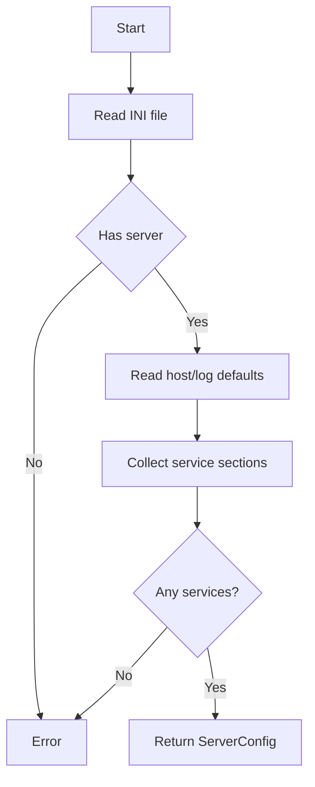

# Config Loader

## Purpose
Parse `config.ini` and return structured configuration objects for the server.

## Inputs
- Path to `config.ini`

## Outputs
- `ServerConfig` with host, log level, defaults, and service configuration

## Conditions and Logic
- Validate presence of `[server]` section
- Extract `host`
- Extract `log_level`
- Extract default response settings
- Collect every `[service:<name>]` section
- Parse each service method, port, code, and delay
- Require at least one service definition

## Flow (Mermaid)

