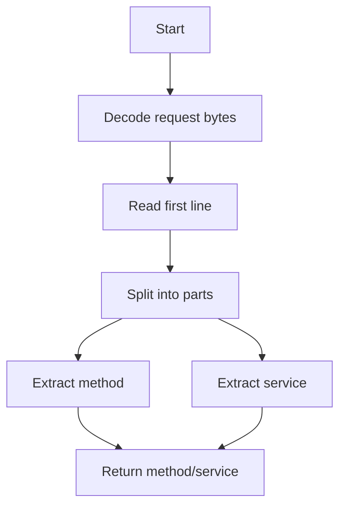

# ICAP Protocol Helpers

## Purpose
Parse ICAP request lines to determine method and service name for routing.

## Inputs
- Raw ICAP request bytes

## Outputs
- Request text (decoded)
- Parsed method and service name

## Conditions and Logic
- Decode bytes with safe fallbacks
- Parse first line as `METHOD icap://host/service ICAP/1.0`
- Extract service name after the last `/`

## Flow (Mermaid)

