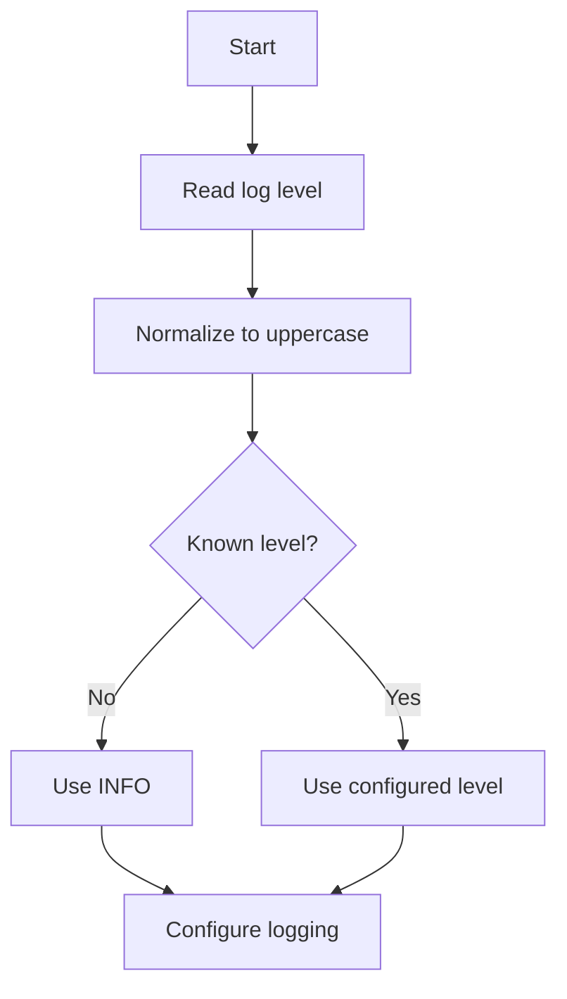

# Logging Setup

## Purpose
Configure application logging based on the configured log level.

## Inputs
- Log level string from `config.ini`

## Outputs
- Global logging configuration

## Conditions and Logic
- Normalize log level to uppercase
- Fallback to `INFO` when the value is unknown
- Apply a consistent log format

## Flow (Mermaid)

