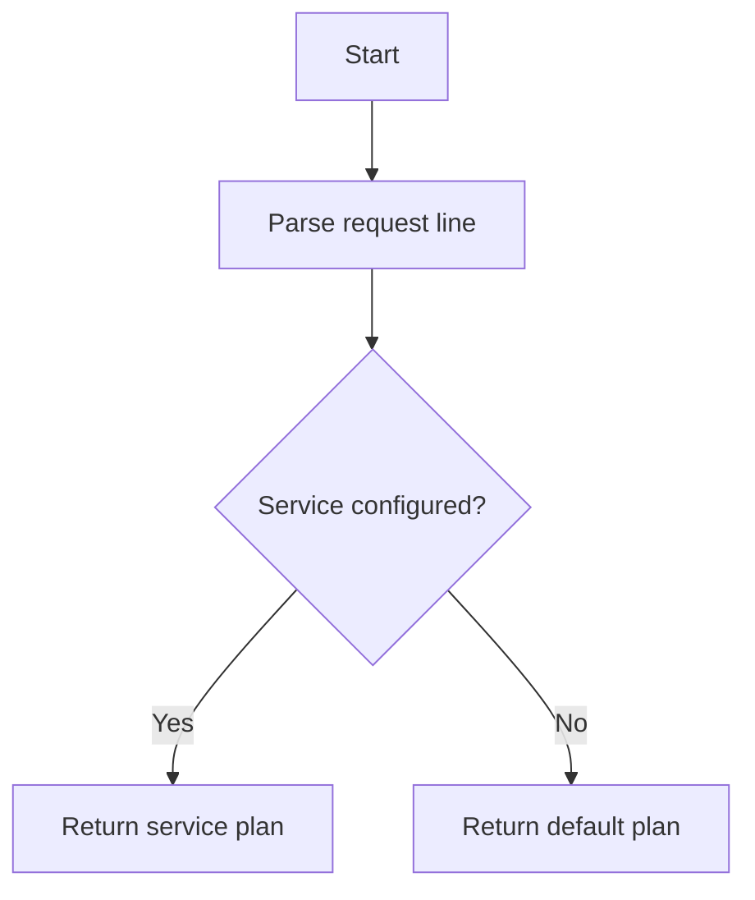

# Port Handler

## Purpose
Encapsulate response behavior specific to a port.

## Inputs
- Port number
- Services map: method -> service -> response plan
- Default response plan

## Outputs
- `ResponsePlan` for response builder

## Conditions and Logic
- Parse ICAP request line to determine method and service
- If service is configured for the method, return its plan
- Otherwise fall back to default response plan

## Flow (Mermaid)

