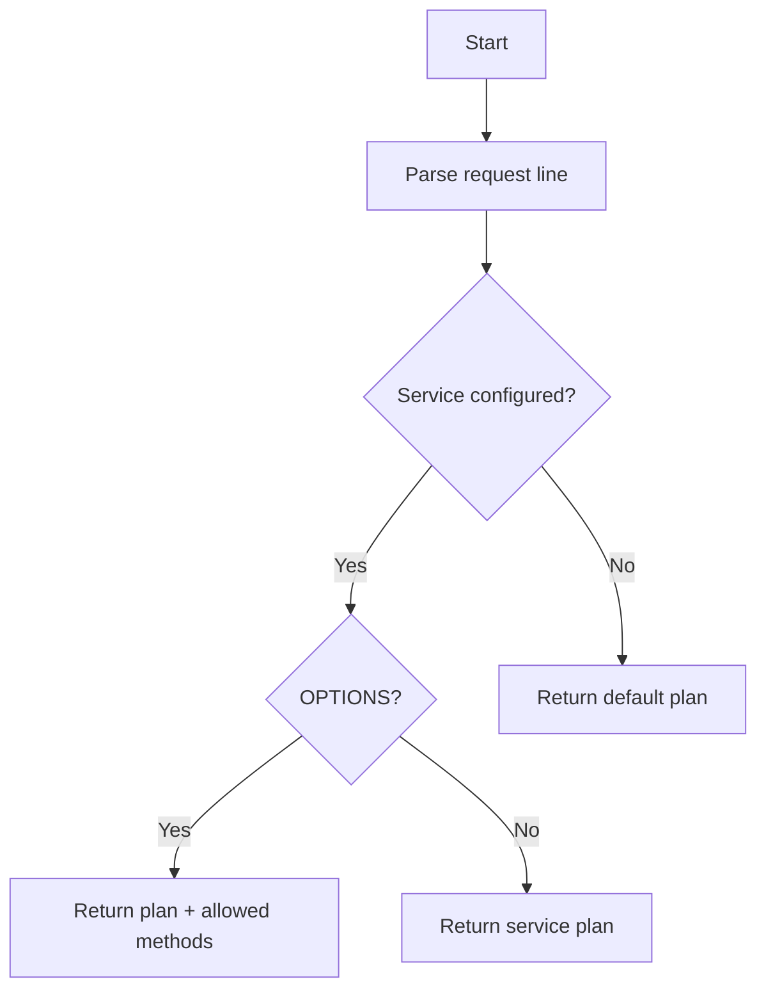

# Port Handler

## Purpose
Encapsulate response behavior specific to a port.

## Inputs
- Port number
- Services map: service -> route (reqmod/respmod + plan)
- Default response plan

## Outputs
- `ResponsePlan` for response builder
- Requested service name from ICAP request
- Resolved service name (or none)
- Allowed ICAP methods for OPTIONS (ordered tuple)

## Conditions and Logic
- Parse ICAP request line to determine method and service
- If service allows the request method, return its plan
- For OPTIONS on a known service, return allowed methods (REQMOD/RESPMOD)
- Otherwise fall back to default response plan

## Flow (Mermaid)

