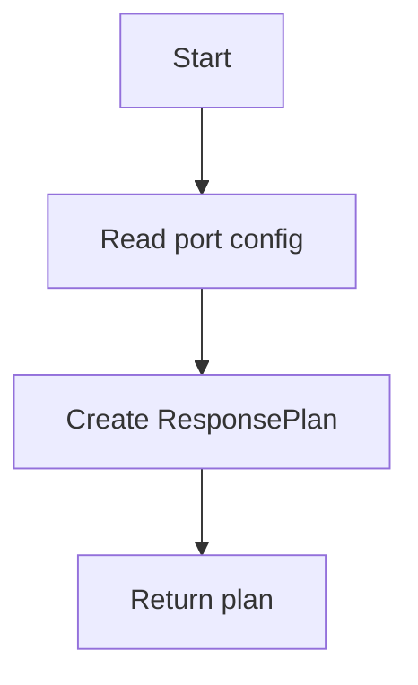

# Port Handler

## Purpose
Encapsulate response behavior specific to a port.

## Inputs
- Port number
- Response code
- Response delay in ms

## Outputs
- `ResponsePlan` for response builder

## Conditions and Logic
- Convert port configuration into a response plan

## Flow (Mermaid)

