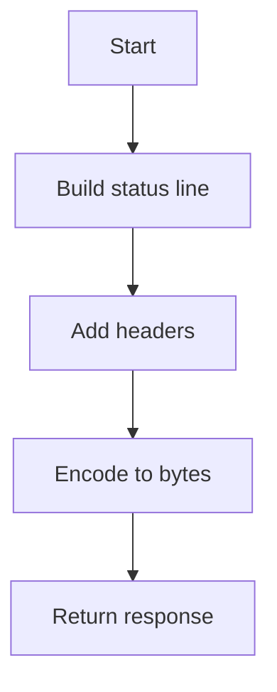

# Response Builder

## Purpose
Generate ICAP response bytes based on a response plan.

## Inputs
- `ResponsePlan` with status code and delay
- Optional extra ICAP headers (e.g., `Methods` for OPTIONS)
- Flag to include encapsulated HTTP response
- ICAP status code override (defaults to 200 when encapsulating)

## Outputs
- ICAP response bytes
- ICAP response bytes with optional encapsulated HTTP response

## Conditions and Logic
- Map status codes to standard reason phrases
- Include minimal ICAP headers
- Append optional extra headers before the blank line terminator
- When enabled, append `Encapsulated: res-hdr=0` and an HTTP response payload

## Flow (Mermaid)

