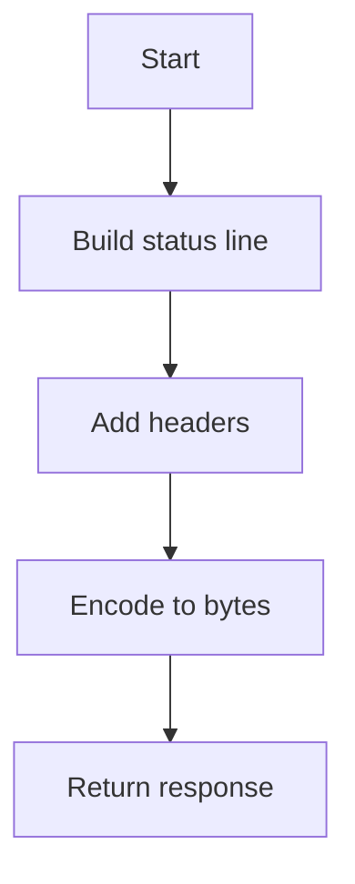

# Response Builder

## Purpose
Generate ICAP response bytes based on a response plan.

## Inputs
- `ResponsePlan` with status code and delay

## Outputs
- ICAP response bytes

## Conditions and Logic
- Map status code to a short status text
- Include minimal ICAP headers

## Flow (Mermaid)

