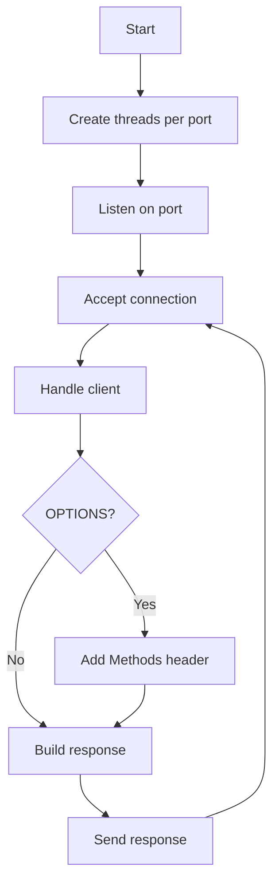

# ICAP Server

## Purpose
Accept ICAP connections on multiple ports and send responses via handlers.

## Inputs
- List of `ListeningPort` definitions

## Outputs
- Network responses to connected clients

## Conditions and Logic
- Spawn one thread per listening port
- Accept connections in a loop
- Delegate response planning to port handlers
- For OPTIONS requests, include `Methods` header based on allowed methods
- When debug logging is enabled, log response decision details and raw response
- Send ICAP response and close connection

## Flow (Mermaid)

